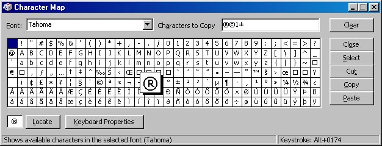



## Character Map

### Description

THIS CODE HAS BEEN UPDATED, GOTO http://www.planet-source-code.com/vb/scripts/ShowCode.asp?txtCodeId=36149&lngWId=1

Updated Version - Now with no flickering or need for the Common Controls OCX.

I also used the proper DrawFocusRect API rather than just using a rectangle shape.

-=-=-=-=-=-=-=-=-=-=-=-=-=-=-=-=

This is my first submission to PSC - it is a character map form that you can use in your own apps. Includes a locate function that flashes the character if it is found.
 
### More Info
 

             |
---                |---
**Submitted On**   |2001-06-05 20:52:28
**By**             |[Rick Bull](https://github.com/Planet-Source-Code/PSCIndex/blob/master/ByAuthor/rick-bull.md)
**Level**          |Intermediate
**User Rating**    |4.8 (29 globes from 6 users)
**Compatibility**  |VB 5\.0, VB 6\.0
**Category**       |[Object Oriented Programming \(OOP\)](https://github.com/Planet-Source-Code/PSCIndex/blob/master/ByCategory/object-oriented-programming-oop__1-47.md)
**World**          |[Visual Basic](https://github.com/Planet-Source-Code/PSCIndex/blob/master/ByWorld/visual-basic.md)
**Archive File**   |[Character 20641652001\.zip](https://github.com/Planet-Source-Code/rick-bull-character-map__1-23770/archive/master.zip)

